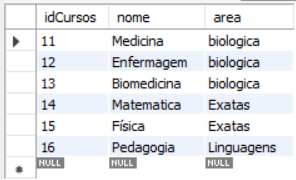
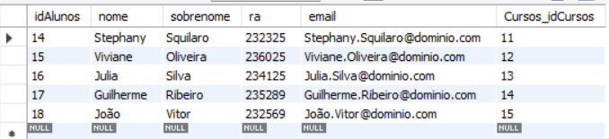

 <h1 align="center" > Sistema Universidade (FUNCTIONS)</h1>

 ### Crie um banco de dados para armazenar alunos e cursos de uma universidade
* Cada curso pode pertencer a somente uma área
  
```mysql
CREATE TABLE IF NOT EXISTS `faculdade`.`cursos` (
  `idCursos` INT NOT NULL AUTO_INCREMENT,
  `nome` VARCHAR(100) NULL DEFAULT NULL,
  `area` varchar(100) null,
  PRIMARY KEY (`idCursos`))
ENGINE = InnoDB
AUTO_INCREMENT = 11
DEFAULT CHARACTER SET = utf8mb3;

CREATE TABLE IF NOT EXISTS `faculdade`.`alunos` (
  `idAlunos` INT NOT NULL AUTO_INCREMENT,
  `nome` VARCHAR(100) NULL DEFAULT NULL,
  `sobrenome` VARCHAR(100) NULL DEFAULT NULL,
  `ra` INT NULL DEFAULT NULL,
  `email` VARCHAR(100) NULL DEFAULT NULL,
  `Cursos_idCursos` INT NOT NULL,
  PRIMARY KEY (`idAlunos`, `Cursos_idCursos`),
  INDEX `fk_Alunos_Cursos_idx` (`Cursos_idCursos` ASC) VISIBLE,
  CONSTRAINT `fk_Alunos_Cursos`
    FOREIGN KEY (`Cursos_idCursos`)
    REFERENCES `faculdade`.`cursos` (`idCursos`))
ENGINE = InnoDB
AUTO_INCREMENT = 13
DEFAULT CHARACTER SET = utf8mb3;

```

### 1- Utilize Stored Procedures para automatizar a inserção e seleção dos cursos

#### Criação do stored procedure:
```mysql
DELIMITER $$
USE `faculdade`$$
CREATE DEFINER=`root`@`localhost` PROCEDURE `inserir_cursos`(
nome varchar(100),
area varchar(100)
)
begin
    insert into cursos (nome, area) values (nome, area);
end$$

DELIMITER ;

```
#### inserção:
```mysql
call faculdade.inserir_cursos('Medicina', 'biologia');
call faculdade.inserir_cursos('engenharia de computação', 'exatas');
call faculdade.inserir_cursos('Biomedicina', 'biologia');
call faculdade.inserir_cursos('Enfermagem', 'biologia');
call faculdade.inserir_cursos('advogado', 'direito');
```

#### Seleção:
```mysql
DELIMITER $$
USE `faculdade`$$
CREATE DEFINER=`root`@`localhost` PROCEDURE `consulta_cursos`()
begin
    select *
    from Cursos;
end$$

DELIMITER ;
```

#### Como ficou a seleção:


### 2- O aluno possui um e-mail que deve ter seu endereço gerado automaticamente no seguinte formato: nome.sobrenome@dominio.com

#### Criação do trigger:
```mysql

DELIMITER $$
USE `faculdade`$$
CREATE
DEFINER=`root`@`localhost`
TRIGGER `faculdade`.`gerar_email_aluno`
BEFORE INSERT ON `faculdade`.`alunos`
FOR EACH ROW
BEGIN
  SET NEW.email = CONCAT(NEW.nome, '.', NEW.sobrenome, '@dominio.com');
END$$

DELIMITER ;
```

#### Inserção:
```mysql
INSERT INTO alunos (nome, sobrenome, ra, Cursos_idCursos) VALUES('Stephany', 'Squilaro', '232325',  11);
INSERT INTO alunos (nome, sobrenome, ra, Cursos_idCursos) VALUES('Viviane', 'Oliveira', '236025', 12);
INSERT INTO alunos (nome, sobrenome, ra, Cursos_idCursos) VALUES('Julia', 'Silva', '234125', 13);
INSERT INTO alunos (nome, sobrenome, ra, Cursos_idCursos) VALUES('Guilherme', 'Ribeiro', '235289', 14);
INSERT INTO alunos (nome, sobrenome, ra, Cursos_idCursos) VALUES('João', 'Vitor', '232569', 15);
```

#### Seleção dos alunos:


### 3- Crie uma rotina que recebe os dados de um novo curso e o insere no banco de dados

```mysql
DELIMITER $$
USE `faculdade`$$
CREATE DEFINER=`root`@`localhost` PROCEDURE `inserir_curso`(
  IN p_nome VARCHAR(100),
  IN p_area VARCHAR(100)
)
BEGIN
  INSERT INTO Cursos (nome, area) VALUES (p_nome, p_area);
END$$

DELIMITER ;
```

### 4- Crie uma função que recebe o nome de um curso e sua área, em seguida retorna o id do curso

```mysql
delimiter $
CREATE FUNCTION obter_id_curso(
  p_nome_curso VARCHAR(100),
  p_area_curso VARCHAR(100)
)
RETURNS INT
DETERMINISTIC
BEGIN
  DECLARE curso_id INT;
  
  SELECT idCursos INTO curso_id
  FROM Cursos
  WHERE nome = p_nome_curso AND area = p_area_curso;
  
  RETURN curso_id;
END$

DELIMITER ;
```

#### chamando a função:
```mysql
select faculdade.obter_id_curso('biomedicina', 'biologia') as id_do_curso;
```


### 5- Crie uma procedure que recebe os dados do aluno e de um curso e faz sua matrícula
#### "Caso o aluno já esteja matriculado em um curso, essa matrícula não pode ser realizada"
