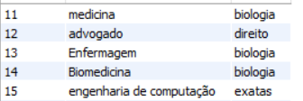

 <h1 align="center" > Sistema Universidade (FUNCTIONS)</h1>

 ### Crie um banco de dados para armazenar alunos e cursos de uma universidade
* Cada curso pode pertencer a somente uma área
  
```mysql
CREATE TABLE IF NOT EXISTS `faculdade`.`cursos` (
  `idCursos` INT NOT NULL AUTO_INCREMENT,
  `nome` VARCHAR(100) NULL DEFAULT NULL,
  `area` varchar(100) null,
  PRIMARY KEY (`idCursos`))
ENGINE = InnoDB
AUTO_INCREMENT = 11
DEFAULT CHARACTER SET = utf8mb3;

CREATE TABLE IF NOT EXISTS `faculdade`.`alunos` (
  `idAlunos` INT NOT NULL AUTO_INCREMENT,
  `nome` VARCHAR(100) NULL DEFAULT NULL,
  `sobrenome` VARCHAR(100) NULL DEFAULT NULL,
  `ra` INT NULL DEFAULT NULL,
  `email` VARCHAR(100) NULL DEFAULT NULL,
  `Cursos_idCursos` INT NOT NULL,
  PRIMARY KEY (`idAlunos`, `Cursos_idCursos`),
  INDEX `fk_Alunos_Cursos_idx` (`Cursos_idCursos` ASC) VISIBLE,
  CONSTRAINT `fk_Alunos_Cursos`
    FOREIGN KEY (`Cursos_idCursos`)
    REFERENCES `faculdade`.`cursos` (`idCursos`))
ENGINE = InnoDB
AUTO_INCREMENT = 13
DEFAULT CHARACTER SET = utf8mb3;

```

### 1- Utilize Stored Procedures para automatizar a inserção e seleção dos cursos

#### inserção:
```mysql
DELIMITER $$
USE `faculdade`$$
CREATE DEFINER=`root`@`localhost` PROCEDURE `insert_cursos`(
nome varchar(100),
area varchar(100)
)
begin
    insert into cursos (nome, area) values (nome, area);
end$$

DELIMITER ;

```

#### Seleção:
```mysql
DELIMITER $$
USE `faculdade`$$
CREATE DEFINER=`root`@`localhost` PROCEDURE `consulta_cursos`()
begin
    select *
    from Cursos;
end$$

DELIMITER ;
```

#### Como ficou a seleção:


### 2- O aluno possui um e-mail que deve ter seu endereço gerado automaticamente no seguinte formato: nome.sobrenome@dominio.com

#### Criação do trigger:
```mysql

DELIMITER $$
USE `faculdade`$$
CREATE
DEFINER=`root`@`localhost`
TRIGGER `faculdade`.`gerar_email_aluno`
BEFORE INSERT ON `faculdade`.`alunos`
FOR EACH ROW
BEGIN
  SET NEW.email = CONCAT(NEW.nome, '.', NEW.sobrenome, '@dominio.com');
END$$

DELIMITER ;
```

#### Inserção:
```mysql
INSERT INTO alunos (nome, sobrenome, ra, Cursos_idCursos) VALUES('Stephany', 'Squilaro', '232325',  11);
INSERT INTO alunos (nome, sobrenome, ra, Cursos_idCursos) VALUES('Viviane', 'Oliveira', '236025', 12);
INSERT INTO alunos (nome, sobrenome, ra, Cursos_idCursos) VALUES('Julia', 'Silva', '234125', 13);
INSERT INTO alunos (nome, sobrenome, ra, Cursos_idCursos) VALUES('Guilherme', 'Ribeiro', '235289', 14);
INSERT INTO alunos (nome, sobrenome, ra, Cursos_idCursos) VALUES('João', 'Vitor', '232569', 15);
```

#### Seleção dos alunos:

